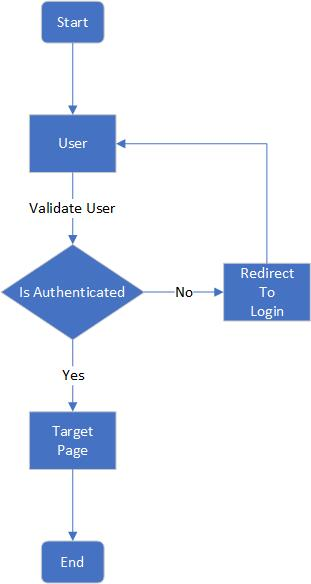
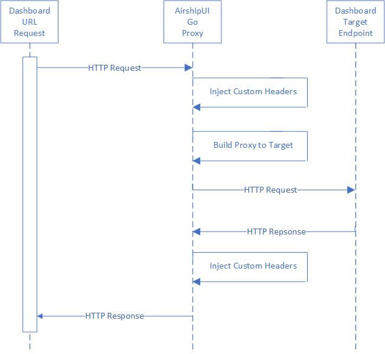

# Airship UI Developer's Guide

## Prerequisites
1. [Go](https://golang.org/dl/) v1.13 or newer

## Getting Started

Clone the Airship UI repository and build.

    git clone https://opendev.org/airship/airshipui
    cd airshipui
    make # Note running behind a proxy can cause issues, notes on solving is in the Appendix

**NOTE:** Make will install node.js-v12.16.3 into your tools directory and will use that as the node binary for the UI
building, testing and linting.  For windows this can be done using [cygwin](https://www.cygwin.com/) make.

Run the airshipui binary

    ./bin/airshipui

## Security

### Transport Layer Security
The UI will need to send sensitive / receive information therefore all channels of communication will need to be encrypted.  The main protocol for this is [HTTPS](https://en.wikipedia.org/wiki/HTTPS), and the websocket communication is also over the secured channel ([wss](https://tools.ietf.org/html/rfc6455#page-55))

The airshipui stores the public and private key location in the etc/airshipui.json by default.  If one is not present at the time of the airshipui is started a self signed certificate and private key will be generated and stored in etc/airshipui.json for the server to start in a developer's mode.  This will cause an SSL error on your browser that 
you will need to click past to get to the UI.  It is assumed the server will have access to the proper key & certificate in production.  Both the private key and certificate need to be ASCII PEM formatted.

Example webservice definition in etc/airshipui.json:
```
    "webservice": {
        "host": "<host, default is localhost>",
        "port": <port, default is 10443>,
        "publicKey": "<path>/<cert>.pem",
        "privateKey": "<path>/<private_key>.pem"
    },
```
### User Authentication
The UI uses Json Web Tokens ([JWT](https://tools.ietf.org/html/rfc7519)) to control access to the UI.  The default method of generation is based on a userid and password enforcement
that the user is required to enter the first time accessing the UI.  The UI will store the token locally and use it to authenticate the communication with the backend on every 
transaction.  

The airshipui stores the user and password in etc/airshipui.json by default.  The userid is clear text but the password is an non reversible sha512 hash of the password which is used to compare the supplied password with the expected password.  No clear text passwords are stored.

If no id and password is supplied the airshipui will create a default userid and password and store it in the etc/airshipui.json file so there will be no ability to use the UI
without a base id / password challenge authentication.  

The default userid is: admin  The default password is: admin

To generate a password you can run the password.go program in the tools directory:
```
$ go run tools/password.go test_password
c8afeec4e9d29fa6307bc246965fe136a95bc47a9cfdedba0df256358eaa45ec0bf8d7a4333a4b13dc9a5508137d0f4d212272b27e64e41d4745a66b5f480759
```

Example user definition in etc/airshipui.json:
``` 
    "users": {
        "test": "c8afeec4e9d29fa6307bc246965fe136a95bc47a9cfdedba0df256358eaa45ec0bf8d7a4333a4b13dc9a5508137d0f4d212272b27e64e41d4745a66b5f480759"
    }
```
After the user is defined in the etc/airshipui.json file the user can be used for authentication going forward.

### Authentication decision tree


## Behind the scenes

### AirshipUI interaction


### Communication with the backend
The UI and the Go backend use a [websocket](https://en.wikipedia.org/wiki/WebSocket) to stream JSON between the UI
and the backend. The use of a websocket instead of a more conventional HTTP REST invocation allows the backend to
notify the UI of any updates, alerts, and information in real time without the need to set a poll based timer on
the UI. Once the data is observed it can be transformed and moved to the UI asynchronously.

The UI will initiate the websocket and request data. The backend uses a function map to determine which subsystem is
responsible for the request and responds with configuration information, alerts, files, and data.

### Communication with the dashboards
Dashboards may or may not be generally available for end users based on the cluster the AirshipUI is deployed to.  If access to the endpoint is controlled in a way that is not easy to manipulate or if a Single Sign On approach is necessary the AirhshipUI provides the ability to proxy the targeted dashboard.

### AirshipUI proxy interaction


## Appendix

### Minikube

[Minikube](https://kubernetes.io/docs/setup/learning-environment/minikube/) runs a single-node Kubernetes cluster
for users looking to try out Kubernetes or develop with it day-to-day. Installation instructions are available on
the kubernetes website: https://kubernetes.io/docs/tasks/tools/install-minikube/). If you are running behind a
proxy it may be necessary to follow the steps outlined in the
[How to use an HTTP/HTTPS proxy with minikube](https://minikube.sigs.k8s.io/docs/reference/networking/proxy/)
website.

### Docker on Windows

The default Docker install on windows will attempt to enable Hyper-V. Note: if you are using VirtualBox it cannot 
coexist with Hyper-V enabled at the same time. To build docker images you will have to shut down VirtualBox and 
enable Hyper-V for the build. You will need to disable Hyper-V to use VirtualBox after the images have been built.

### Issues with npm
If you're running behind a corporate proxy, you may see this error:

    npm ERR! network connect ETIMEDOUT
    npm ERR! network This is most likely not a problem with npm itself
    npm ERR! network and is related to network connectivity.
    npm ERR! network In most cases you are behind a proxy or have bad network settings.
    npm ERR! network
    npm ERR! network If you are behind a proxy, please make sure that the
    npm ERR! network 'proxy' config is set properly.  See: 'npm help config'

To solve this issue, you must tell npm to utilize the proxy by using these commands:

    npm config set proxy http://proxy.company.com:PORT
    npm config set https-proxy http://proxy.company.com:PORT

If your corporate proxy terminates the SSL at the firewall you may also see this error:

    $ npm install .
    npm WARN monaco-editor-samples@0.0.1 No repository field.

    npm ERR! code UNABLE_TO_GET_ISSUER_CERT_LOCALLY
    npm ERR! errno UNABLE_TO_GET_ISSUER_CERT_LOCALLY
    npm ERR! request to https://registry.npmjs.org/yaserver/-/yaserver-0.2.0.tgz failed, reason: unable to get local issuer certificate

    npm ERR! A complete log of this run can be found in:
    npm ERR!     /home/user/npm-cache/_logs/2020-06-16T18_19_34_581Z-debug.log

If you normally have to install a certificate authority to use the corporate proxy you will need to instruct NPM to use
it:

    export NODE_EXTRA_CA_CERTS=/<path>/<truststore>.pem

### Optional proxy settings

#### Environment settings for wget or curl

If your network has a proxy preventing successful curls or wgets you may need to set the proxy environment variables.
The local ip is included in the no_proxy setting to prevent any local running process that may attempt api calls against
it from being sent through the proxy for the request:

    ```
    export http_proxy=<proxy_host>:<proxy_port>
    export HTTP_PROXY=<proxy_host>:<proxy_port>
    export https_proxy=<proxy_host>:<proxy_port>
    export HTTPS_PROXY=<proxy_host>:<proxy_port>
    export no_proxy=localhost,127.0.0.1,<LOCAL_IP>
    export NO_PROXY=localhost,127.0.0.1,<LOCAL_IP>
    ```