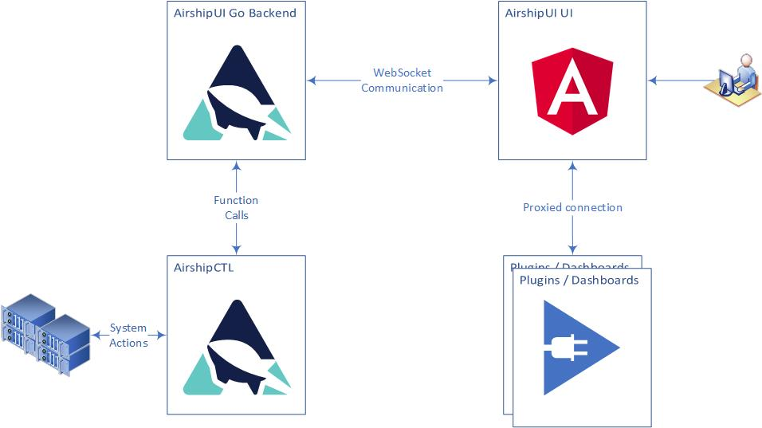

# Airship UI Developer's Guide

## Prerequisites
1. [Go](https://golang.org/dl/) v1.13 or newer

## Getting Started

Clone the Airship UI repository and build.

    git clone https://opendev.org/airship/airshipui
    cd airshipui
    make # Note running behind a proxy can cause issues, notes on solving is in the Appendix
    make examples # (optional)
    make install-octant-plugins # (if running with octant)

**NOTE:** Make will install node.js-v12.16.3 into your tools directory and will use that as the node binary for the UI
building, testing and linting.

Run the airshipui binary

    ./bin/airshipui

## Authentication

### Pluggable authentication methods
The AirshipUI is not designed to create authentication credentials but to have them supplied to it either by a
configuration or by an external entity. The expectation is that there will be an external URL that will handle
authentication for the system which may need to be modified or created. The endpoint will need to be able to
forward a
[bearer token](https://oauth.net/2/bearer-tokens/),
[basic auth](https://en.wikipedia.org/wiki/Basic_access_authentication)
or cookie data to the Airship UI backend service.

To configure the pluggable authentication the following must be added to the $HOME/.airshipui/airshipui.json file:

    "authMethod": {
        "url": "<protocol>://<host:port>/<path>/<method>"
    }

Note: By default the system will start correctly without any authentication urls supplied to the configuration.
The expectation is that AirshipUI will be running in a minimal least authorized configuration.

### Example Auth Server
There is an example authentication server in examples/authentication/main.go. These endpoints can be added to the
$HOME/.airshipui/airshipui.json and will allow the system to show a basic authentication test.
1. Basic auth on http://127.0.0.1:12321/basic-auth
2. Cookie based auth on http://127.0.0.1:12321/cookie
3. OAuth JWT (JSON Web Token) on http://127.0.0.1:12321/oauth

To start the system cd to the root of the AirshipUI repository and execute:

    go run examples/authentication/main.go

#### Example Auth Server Credentials
+ The example auth server id is: **airshipui**
+ The example auth server password is: **Open Sesame!**

## Plugins

### Octant

[Octant](https://github.com/vmware-tanzu/octant) is a tool for developers to understand how applications run on a
Kubernetes cluster. It aims to be part of the developer's toolkit for gaining insight and approaching complexity
found in Kubernetes. Octant offers a combination of introspective tooling, cluster navigation, and object management
 along with a plugin system to further extend its capabilities.

Octant needs to be pointed to a Kubernetes Cluster. It is recommended to use
[Minikube](https://kubernetes.io/docs/tasks/tools/install-minikube/) for development.

#### Running the example
Build the octant plugin executable

    make install-octant-plugins

When you run the octant binary, the plugin should show "Hello World just some text on the page" under the
http://127.0.0.1:7777/#/airshipui-example-plugin url.

#### How to get and build Octant
If you are going to do serious Octant development you will need to adhere to
[Octant's Hacking Guide](https://github.com/vmware-tanzu/octant/blob/master/HACKING.md)
which includes information on how to build Octant, and the steps to push changes to them.

## Behind the scenes

### AirshipUI interaction



### Communication with the backend
The UI and the Go backend use a [websocket](https://en.wikipedia.org/wiki/WebSocket) to stream JSON between the UI
and the backend. The use of a websocket instead of a more conventional HTTP REST invocation allows the backend to
notify the UI of any updates, alerts, and information in real time without the need to set a poll based timer on
the UI. Once the data is observed it can be transformed and moved to the UI asynchronously.

The UI will initiate the websocket and request data. The backend uses a function map to determine which subsystem is
responsible for the request and responds with configuration information, alerts, files, and data.

## Appendix

### Minikube

[Minikube](https://kubernetes.io/docs/setup/learning-environment/minikube/) runs a single-node Kubernetes cluster
for users looking to try out Kubernetes or develop with it day-to-day. Installation instructions are available on
the kubernetes website: https://kubernetes.io/docs/tasks/tools/install-minikube/). If you are running behind a
proxy it may be necessary to follow the steps outlined in the
[How to use an HTTP/HTTPS proxy with minikube](https://minikube.sigs.k8s.io/docs/reference/networking/proxy/)
website.

### Docker on Windows

The default Docker install on windows will attempt to enable Hyper-V. Note: if you are using VirtualBox it cannot 
coexist with Hyper-V enabled at the same time. To build docker images you will have to shut down VirtualBox and 
enable Hyper-V for the build. You will need to disable Hyper-V to use VirtualBox after the images have been built.

### Issues with npm
If you're running behind a corporate proxy, you may see this error:

    npm ERR! network connect ETIMEDOUT
    npm ERR! network This is most likely not a problem with npm itself
    npm ERR! network and is related to network connectivity.
    npm ERR! network In most cases you are behind a proxy or have bad network settings.
    npm ERR! network
    npm ERR! network If you are behind a proxy, please make sure that the
    npm ERR! network 'proxy' config is set properly.  See: 'npm help config'

To solve this issue, you must tell npm to utilize the proxy by using these commands:

    npm config set proxy http://proxy.company.com:PORT
    npm config set https-proxy http://proxy.company.com:PORT

If your corporate proxy terminates the SSL at the firewall you may also see this error:

    $ npm install .
    npm WARN monaco-editor-samples@0.0.1 No repository field.

    npm ERR! code UNABLE_TO_GET_ISSUER_CERT_LOCALLY
    npm ERR! errno UNABLE_TO_GET_ISSUER_CERT_LOCALLY
    npm ERR! request to https://registry.npmjs.org/yaserver/-/yaserver-0.2.0.tgz failed, reason: unable to get local issuer certificate

    npm ERR! A complete log of this run can be found in:
    npm ERR!     /home/user/npm-cache/_logs/2020-06-16T18_19_34_581Z-debug.log

If you normally have to install a certificate authority to use the corporate proxy you will need to instruct NPM to use
it:

    export NODE_EXTRA_CA_CERTS=/<path>/<truststore>.pem

### Optional proxy settings

#### Environment settings for wget or curl

If your network has a proxy preventing successful curls or wgets you may need to set the proxy environment variables.
The local ip is included in the no_proxy setting to prevent any local running process that may attempt api calls against
it from being sent through the proxy for the request:

    ```
    export http_proxy=<proxy_host>:<proxy_port>
    export HTTP_PROXY=<proxy_host>:<proxy_port>
    export https_proxy=<proxy_host>:<proxy_port>
    export HTTPS_PROXY=<proxy_host>:<proxy_port>
    export no_proxy=localhost,127.0.0.1,<LOCAL_IP>
    export NO_PROXY=localhost,127.0.0.1,<LOCAL_IP>
    ```